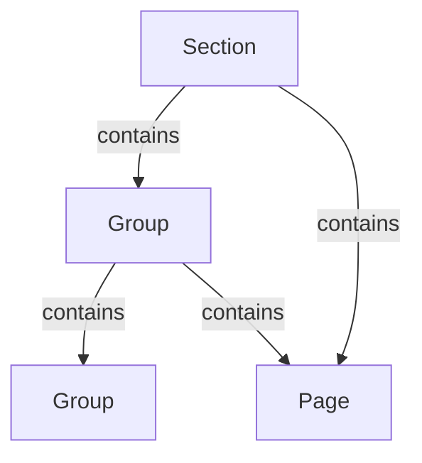

import { LayoutComponent } from '@unterberg/nivel' 

<LayoutComponent>

</LayoutComponent>

<LayoutComponent $size="sm">
import { Table } from '@unterberg/nivel'

## April 2026

## Einordnung

Die folgenden Einträge liegen vor dem beantragten Vorhabensbeginn am 01.05.2026.

Sie dokumentieren vorbereitende Arbeiten, technische Ausgangsbasis und initiale Strukturierung der FuE-Dokumentation. Diese Tätigkeiten werden nicht als förderfähige Eigenleistung im Rahmen der Forschungszulage angesetzt.

Reine UI- und Darstellungsanpassungen wurden aus dieser Übersicht entfernt oder nur berücksichtigt, soweit sie unmittelbar der Nivel-Engine, der Dokumentationsstruktur oder der forschungsbezogenen Nachweisführung dienten.

---

<Table
  size="sm"
  data={{
    headers: [
      'Datum',
      'Zeit',
      'Dauer',
      'Einordnung',
      'AP',
      'Tätigkeit',
      'FuE-Bezug / Bedeutung für das Vorhaben',
      'Nachweis / Ergebnis',
    ],
    rows: [
      [
        '25.04.2026',
        '17:00–18:30',
        '1,5 h',
        'Vorbereitung / technischer Ausgangsstand',
        'AP4',
        'Analyse und Behebung einer Nivel-Kompatibilitätsproblematik bei Consumer-Anwendungen ohne direkte Installation bestimmter optionaler Abhängigkeiten.',
        'Untersucht wurde, inwieweit die Engine von konkreten Consumer-Abhängigkeiten entkoppelt werden kann, ohne die Nutzbarkeit des Basissystems zu beeinträchtigen.',
        'Verbesserte Abgrenzung zwischen Engine, Consumer-App und optionalen Darstellungsschichten.',
      ],
      [
        '25.04.2026',
        '22:00–00:30',
        '2,5 h',
        'Vorbereitung / technischer Ausgangsstand',
        'AP4',
        'Aufsetzen einer einfachen Nivel-Consumer-Anwendung mit `nivel init`; Prüfung von Entwicklungs- und Preview-Skripten; Anlage einer ersten Dokumentationsstruktur für FuE- und Zeiterfassungsinhalte.',
        'Geprüft wurde, ob sich mit Nivel reproduzierbar eine Consumer-Anwendung als Grundlage für die eigene Forschungsdokumentation erzeugen lässt.',
        'Initiale Consumer-Struktur mit DocsGraph, Forschungsseiten und Zeiterfassungsbereich.',
      ],
      [
        '26.04.2026',
        '10:00–11:15',
        '1,25 h',
        'Vorbereitung / Forschungsstruktur',
        'AP1',
        'Umstrukturierung der FuE-Dokumentation; Trennung von Antrag, Arbeitsplan, Zeiterfassung und Forschungspaketen innerhalb des Dokumentationsgraphen.',
        'Untersucht wurde, wie projektbezogene Forschungs- und Nachweisinhalte innerhalb derselben graphbasierten Dokumentationsstruktur abgebildet werden können.',
        'Angepasste Dokumentationsstruktur mit getrennten Bereichen für FuE-Antrag, Zeitnachweise und Forschungspakete.',
      ],
      [
        '26.04.2026',
        '21:15–23:30',
        '2,25 h',
        'Vorbereitung / methodische Herleitung',
        'AP1',
        'Erstellung einer Übersicht zum Strukturmodell sowie Ergänzung einer Forschungsseite zu alternativen Modellierungsansätzen für Dokumentationsstrukturen.',
        'Verglichen wurden mögliche Strukturierungsansätze, um die Eignung eines graphbasierten Modells für Nivel methodisch herzuleiten.',
        'Forschungsseite zur methodischen Herleitung des Graphmodells und Vergleich alternativer Strukturierungsansätze.',
      ],
      [
        '27.04.2026',
        '17:00–18:15',
        '1,25 h',
        'Vorbereitung / Kontextmodell',
        'AP3',
        'Erweiterung der Nivel-Engine zur Nutzung des Docs-Kontexts außerhalb des standardmäßigen Docs-Layouts.',
        'Untersucht wurde, ob aus dem Strukturmodell abgeleitete Kontextinformationen unabhängig vom Standardlayout verfügbar gemacht werden können.',
        'Vorläufige technische Grundlage zur Entkopplung von Docs-Kontext und Standardlayout.',
      ],
      [
        '27.04.2026',
        '19:45–20:15',
        '0,5 h',
        'Vorbereitung / Strukturmodell',
        'AP1',
        'Ergänzung der Forschungsdokumentation zum hierarchischen Strukturmodell und dessen Interpretation als gerichteter Graph.',
        'Geprüft wurde, ob die hierarchische Eingabeform als direkte Graphdefinition oder als ergonomische Notation mit abgeleiteter Graphstruktur zu verstehen ist.',
        'Erweiterung der Forschungsseite zum Strukturmodell.',
      ],
      [
        '27.04.2026',
        '23:30–00:30',
        '1,0 h',
        'Vorbereitung / Formalisierung',
        'AP1',
        'Formalisierung des Strukturmodells durch Beschreibung von Knoten, Kanten und gerichteten Beziehungen.',
        'Untersucht wurde, welche Bestandteile des aktuellen Modells tatsächlich Teil des Strukturgraphen sind und welche Eigenschaften anderen Ebenen zugeordnet werden müssen.',
        'Forschungsseite zur formalen Definition des Strukturmodells.',
      ],
      [
        '28.04.2026',
        '11:30–12:30',
        '0,25 h',
        'Vorbereitung / Präzisierung',
        'AP1',
        'Kleine inhaltliche Anpassungen an der formalen Auslegung des Strukturmodells.',
        'Präzisiert wurde die Abgrenzung zwischen strukturellen Eigenschaften des Graphen und Eigenschaften anderer Systemebenen.',
        'Überarbeitete formale Einordnung des Strukturmodells.',
      ],
      [
        '28.04.2026',
        '17:45–18:30',
        '0,75 h',
        'Vorbereitung / Methodik',
        'AP4',
        'Anpassung der projektinternen Arbeits- und Kommunikationsregeln zur forschungsnahen Einordnung von Annahmen, Beobachtungen, Korrekturen und technischen Entscheidungen.',
        'Ziel war die methodische Absicherung der weiteren Dokumentation, insbesondere die klare Trennung zwischen Annahmen, Beobachtungen, neuen Einordnungen und daraus folgenden Anpassungen.',
        'Verbesserte methodische Grundlage für die weitere FuE-Dokumentation und Zusammenarbeit mit KI-Assistenten.',
      ],
      [
        '29.04.2026',
        '11:30–12:00',
        '0,5 h',
        'Vorbereitung / Nachweisstruktur',
        'AP4',
        'Anpassung der Forschungsunterlagen mit Fokus auf Zeiterfassung, Nachvollziehbarkeit und Übersichtsstruktur.',
        'Untersucht wurde, wie FuE-Tätigkeiten innerhalb des Dokumentationssystems nachvollziehbar und projektbezogen strukturiert werden können.',
        'Überarbeitete Zeiterfassungs- und Übersichtsstruktur.',
      ],
      [
        '29.04.2026',
        '19:30–21:30',
        '2,0 h',
        'Vorbereitung / Systemabgrenzung',
        'AP1',
        'Ergänzung der Forschungsunterlagen zur Abgrenzung bestehender Dokumentationssysteme und deren Modellierungsansätze gegenüber dem Nivel-Strukturmodell.',
        'Geprüft wurde, wie sich bestehende Dokumentationssysteme hinsichtlich Strukturdefinition, Navigation, Routing und Layoutkopplung vom angestrebten Modell unterscheiden.',
        'Forschungsseite zur Abgrenzung zu bestehenden Dokumentationssystemen.',
      ],
      [
        '30.04.2026',
        '20:00–21:30',
        '1,25 h',
        'Vorbereitung / Modellkritik',
        'AP1',
        'Erweiterung der Systemabgrenzung sowie Ergänzung der Forschungsdokumentation um ergonomische Eingabeformen und eine kritische Gegenposition.',
        'Untersucht wurde, ob eine ergonomische hierarchische Eingabeform die formale Klarheit des Graphmodells beeinträchtigt und welche Risiken daraus für spätere Resolver- und Kontextlogik entstehen.',
        'Forschungsseiten zu Systemabgrenzung, ergonomischen Eingabeformen und kritischer Bewertung.',
      ],
    ],
  }}
/>

---

## Ausgeschlossene oder nicht angesetzte Tätigkeiten

<Table
  size="sm"
  data={{
    headers: [
      'Datum',
      'Ursprünglicher Eintrag',
      'Grund der Nichtberücksichtigung',
    ],
    rows: [
      [
        '27.04.2026',
        'Landingpage overview layout',
        'Reine Layout- und Darstellungsarbeit ohne unmittelbaren FuE-Bezug zur Engine oder zum Strukturmodell.',
      ],
      [
        '28.04.2026',
        'Mermaid edgeLabel styles, Textfarbe und Hintergrundfarbe',
        'Überwiegend visuelle Lesbarkeits- und Styling-Anpassung; nicht als eigenständige FuE-Tätigkeit angesetzt.',
      ],
      [
        '30.04.2026',
        'Mehr Abstand im Sidebar-Menü',
        'Reine UI-/Spacing-Anpassung; nicht als FuE-Tätigkeit angesetzt.',
      ],
    ],
  }}
/>

---

## Monatssumme April 2026

<Table
  size="sm"
  data={{
    headers: [
      'Kategorie',
      'Stunden',
      'Einordnung',
    ],
    rows: [
      [
        'AP1 – Strukturmodell',
        '8,5 h',
        'Vorbereitende Analyse und methodische Herleitung, nicht als förderfähige Eigenleistung angesetzt.',
      ],
      [
        'AP3 – Layout / Kontextbereitstellung',
        '1,25 h',
        'Vorbereitende Untersuchung zur Entkopplung von Docs-Kontext und Standardlayout, nicht als förderfähige Eigenleistung angesetzt.',
      ],
      [
        'AP4 – Integration / Validierung / Nachweisstruktur',
        '4,75 h',
        'Vorbereitende Arbeiten an Consumer-Setup, Nachweisstruktur und Methodik, nicht als förderfähige Eigenleistung angesetzt.',
      ],
      [
        'Summe vorbereitende Tätigkeiten',
        '14,5 h',
        'Nicht als förderfähige Eigenleistung angesetzt, da vor Vorhabensbeginn.',
      ],
      [
        'Als FuE-Eigenleistung angesetzt',
        '0,0 h',
        'Förderfähige Erfassung beginnt ab dem 01.05.2026.',
      ],
    ],
  }}
/>

</LayoutComponent>